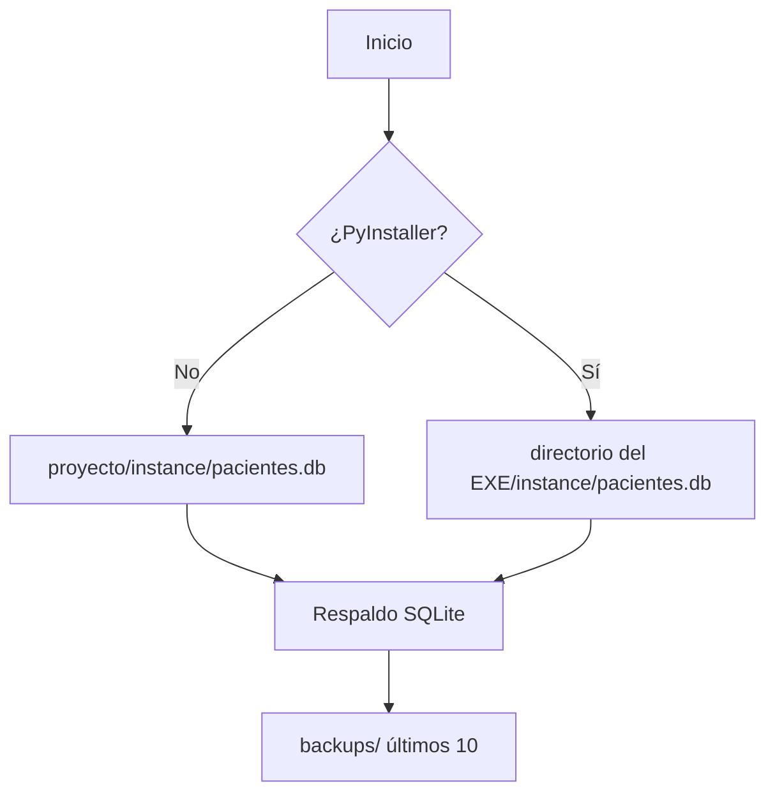

# Arquitectura técnica — versión 1.7.2

## Componentes

- `app/__init__.py`: fábrica Flask, extensiones, blueprints, errores, cabeceras y ciclo de arranque.
- `app/db.py`: ruta persistente, respaldo nativo y migración aditiva de columnas.
- `app/config.py`: secreto, cookies, límites y configuraciones de ambiente.
- `app/core/validators.py`: normalización y validación autoritativa del servidor.
- `app/core/auth.py`, `app/core/security.py` y `app/core/password_recovery.py`: sesión, RBAC, limitación de intentos y recuperación local.
- `app/models/`: esquema SQLAlchemy.
- `app/controllers/`: transacciones y casos de uso.
- `app/templates/` y `app/static/`: interfaz actual preservada y adaptada al dominio clínico general.

El dashboard agrega consultas de lectura acotadas para altas de seis meses, actividad de siete días, próximas citas, pacientes recientes y expedientes pendientes. La consulta de pacientes sin atención reciente se ejecuta únicamente para el perfil profesional de Nutrición; Medicina general y Odontología no reciben ese dato en el contexto de la plantilla. Las gráficas se generan como SVG local a partir de series construidas en servidor; no incorporan bibliotecas de visualización ni servicios externos.

La acción de agenda del KPI reutiliza el blueprint `pacientes` mediante `GET/POST /pacientes/agendar-cita`. El HTML inicial no recibe el padrón. `GET /pacientes/buscar_para_cita` busca bajo demanda sobre pacientes activos, limita a ocho filas y sólo devuelve identidad operativa mínima; `GET /pacientes/disponibilidad_citas` obtiene los 21 bloques diarios con estado `disponible`, `ocupado` o `transcurrido`. Ambas respuestas usan `Cache-Control: no-store`. El POST vuelve a validar paciente activo, fecha, rango, hora, cita previa y conflicto; la comprobación y escritura se serializan dentro del proceso local de Waitress antes del `commit` y la auditoría.

Los popovers usan HTML nativo (`hidden`) como estado seguro. El menú de cuenta reside en el footer del sidebar y se despliega hacia arriba mediante el botón `...`; el topbar no renderiza identidad. El grupo nativo `details/summary` de Administración reduce accesos visibles sin alterar permisos. Recetas enlaza al listado existente con `origen=recetas`, por lo que reutiliza el contrato de consultas sin crear un controlador paralelo. El shell ocupa `100dvh`, mantiene el topbar como elemento no desplazable y reserva `overflow-y` al contenido principal. `app.js` controla sidebar móvil, foco, Escape, búsqueda/navegación, estados planificados y tema persistente; también distingue anclas del mismo documento de una navegación real. Alpine sigue presente en componentes legados, pero no gobierna el shell.

## Persistencia portable

`_MEIPASS` se utiliza solamente para plantillas y recursos incluidos en el ejecutable. Nunca recibe la base de datos o el secreto.

## Esquema clínico

- `Paciente` 1:1 `HistorialClinico`.
- `Paciente` 1:N `ValoracionAntropometrica` (consulta clínica general conservando la tabla histórica).
- `Paciente` 1:N `Cita`, `Pago` y `BitacoraContacto`.
- `ValoracionAntropometrica` 1:N `Receta`; `Receta` 1:N `RecetaMedicamento`.
- `Receta` 0..1:0..1 `Receta` como documento sustituido/reemplazo.
- `Usuario` 1:N `Receta` como emisor, conservando además una instantánea profesional.
- `Usuario` 1:N `AuditLog`.

La denominación interna `valoracion_antropometrica` se conserva para compatibilidad; en la interfaz representa una consulta clínica y sus campos antropométricos son opcionales.

Cada receta ordinaria emitida es un documento independiente e inmutable. La consulta admite un original, recetas adicionales y sustituciones versionadas. Una sustitución marca el folio anterior como no vigente sin reescribirlo y enlaza ambos documentos. Los snapshots almacenan nombre, nacimiento y alergias del paciente, además de nombre, cédula, perfil, establecimiento y domicilio del profesional. La bitácora sólo conserva identificadores, tipo, versión y conteos, nunca el contenido farmacológico.

La interfaz de receta inserta visualmente cada medicamento nuevo al inicio para mantener accesible el botón de alta. Cada fila transporta `orden_medicamento[]`; el validador exige una permutación exacta `1..n`, ordena los datos antes de crear los modelos y la relación los recupera por ID. De este modo, la conveniencia visual no altera el orden clínico persistido o impreso.

## Turno diario de atención

`ValoracionAntropometrica.numero_cita` es el turno ordinal global de una fecha, no un consecutivo por paciente. La restricción `(fecha, numero_cita)` impide duplicados. El GET autenticado `/valoraciones/siguiente-numero` ofrece sólo una proyección sin caché; el POST ignora el valor enviado por el navegador, toma un bloqueo local compartido por los hilos de Waitress, consulta `MAX + 1`, persiste y audita dentro de la misma sección crítica. SQLite aporta una segunda defensa mediante el índice único.

La importación XLSX utiliza el mismo bloqueo y asigna secuencias por fecha. Cambiar una nota a otra fecha reserva el siguiente turno de destino y conserva el evento anterior/nuevo en auditoría. No se renumeran documentos históricos tras eliminaciones o cambios; los reportes de volumen deben usar un conteo de filas.

## Migraciones compatibles

`init_db()` crea tablas faltantes y compara cada tabla conocida mediante `PRAGMA table_info`. Solo ejecuta `ALTER TABLE ... ADD COLUMN` cuando la columna nueva es nullable o posee un valor predeterminado. Si falta una llave primaria o una columna nueva no puede añadirse sin inventar datos, el arranque se detiene.

Este mecanismo no elimina ni renombra columnas. La versión 1.6.0 incorpora una excepción controlada y versionada para retirar la restricción única legada `recetas.valoracion_id`: reconstruye sólo esa tabla dentro de una transacción, conserva todas sus filas, recrea llaves/índices y ejecuta `foreign_key_check` e `integrity_check`. La versión 1.7.2 incorpora otra migración transaccional que normaliza los turnos legados por fecha, `created_at` e ID, y crea el índice único diario después de `integrity_check`. El respaldo de arranque ocurre antes de las migraciones. Cualquier cambio estructural futuro requiere el mismo nivel de copia, prueba y verificación.

Las bases legadas con roles `Admin/Nutricionista/Asistente` se interpretan como `admin/medico/recepcion` sin modificar su restricción histórica; las instalaciones nuevas almacenan exclusivamente el catálogo actual.

Si existe `instance/sgpn.db` y aún no existe `pacientes.db`, la API nativa de SQLite crea una copia íntegra en el nombre nuevo y conserva el archivo legado como recuperación adicional. La clave histórica `.session_secret` se migra de igual forma a `.secret_key`.

## Seguridad

- Todas las rutas funcionales requieren autenticación.
- RBAC en backend: `admin`, `medico`, `recepcion`.
- CSRF para operaciones mutables.
- Scrypt para contraseñas.
- `auth_version` invalida sesiones después de un cambio/restablecimiento.
- Credenciales temporales obligan a elegir una definitiva; la recuperación local sólo opera sobre administradores con acceso al equipo.
- Bloqueo de cuenta y de IP después de cinco fallos.
- Cabeceras CSP, anti-frame, `nosniff`, políticas de origen y no-cache.
- Errores genéricos con `X-Request-ID`.
- Auditoría con usuario, módulo, acción, entidad, IP y resultado.
- Transacciones completas en controladores; los modelos no hacen `commit`.

## Dependencias

El archivo de ejecución conserva solo paquetes utilizados directamente: Flask, Flask-Login, Flask-SQLAlchemy, Flask-WTF, `defusedxml`, `openpyxl` y Waitress. Reducirlo a Flask/OpenPyXL/PyInstaller rompería autenticación, ORM, CSRF y el servidor local; PyInstaller permanece correctamente separado en `requirements-build.txt`.
