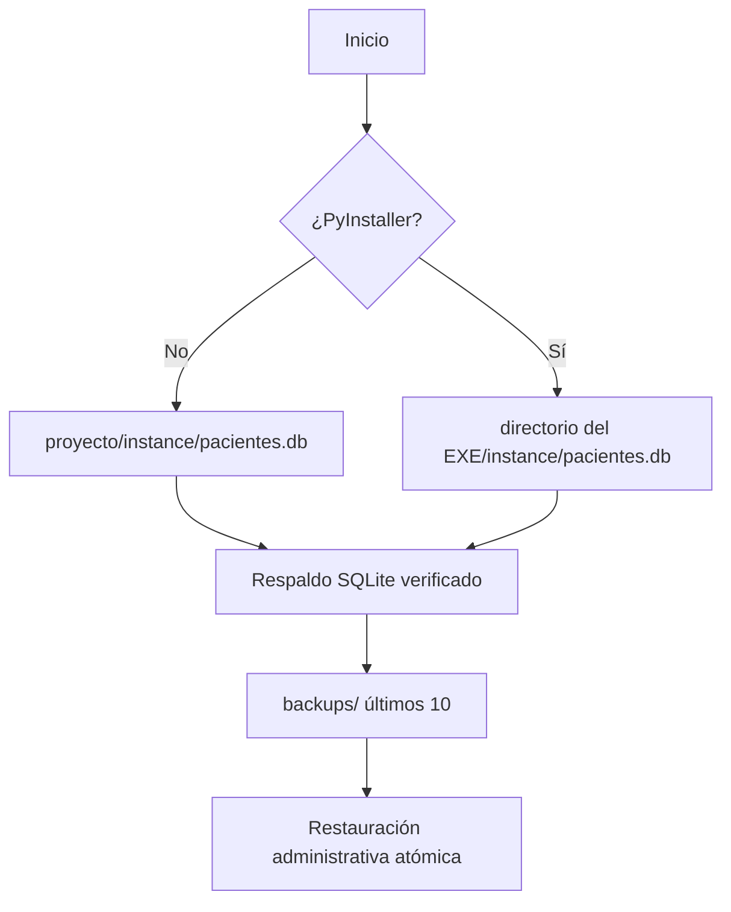

# Arquitectura técnica — versión 1.10.1

## Componentes

- `app/__init__.py`: fábrica Flask, extensiones, blueprints, errores, cabeceras y ciclo de arranque.
- `app/db.py`: ruta persistente, respaldo/restauración nativos, verificación de integridad y migración aditiva de columnas.
- `app/config.py`: secreto, cookies, límites y configuraciones de ambiente.
- `app/core/validators.py`: normalización y validación autoritativa del servidor.
- `app/core/auth.py`, `app/core/security.py` y `app/core/password_recovery.py`: sesión, RBAC, limitación de intentos y recuperación local.
- `app/models/`: esquema SQLAlchemy.
- `app/controllers/`: transacciones y casos de uso.
- `app/controllers/pagos.py`: consulta operativa, agregados filtrados y cancelación administrativa de pagos.
- `app/templates/` y `app/static/`: interfaz autocontenida, utilidades/iconos generados y controladores locales.

El dashboard agrega consultas de lectura acotadas para altas de seis meses, actividad de siete días, próximas citas, pacientes recientes y expedientes pendientes. La consulta de pacientes sin atención reciente se ejecuta únicamente para el perfil profesional de Nutrición; Medicina general y Odontología no reciben ese dato en el contexto de la plantilla. Las gráficas se generan como SVG local a partir de series construidas en servidor; no incorporan bibliotecas de visualización ni servicios externos.

La Agenda operativa vive en el blueprint `agenda`: `GET /agenda` ofrece vistas diaria y semanal; `GET/POST /agenda/citas/<id>/reagendar` modifica una cita programada sin cambiar su identidad o paciente. La creación rápida reutiliza `GET/POST /pacientes/agendar-cita`. El HTML inicial no recibe el padrón. `GET /pacientes/buscar_para_cita` busca bajo demanda sobre pacientes activos, normaliza términos parciales sin mayúsculas ni acentos, limita a ocho filas y sólo devuelve identidad operativa mínima; `GET /pacientes/disponibilidad_citas` obtiene los 21 bloques diarios con estado `disponible`, `ocupado` o `transcurrido` y puede excluir la cita actual durante una reagenda. Estas respuestas usan `Cache-Control: no-store`.

El módulo `pagos` expone `GET /pagos/` para Administración/Recepción y `POST /pagos/<id>/cancelar` exclusivamente para Administración. La consulta une Paciente, reutiliza los términos Unicode parciales y escapados, limita rangos a 366 días, pagina 25 filas y agrega únicamente `monto_centavos` de pagos vigentes. El alta permanece contextual en `POST /pacientes/<id>/pago`, valida la cita opcional contra el paciente y persiste pago/auditoría dentro de una transacción. `operation_key` aporta idempotencia de formulario y la unicidad de base evita duplicados incluso si falla el bloqueo visual.

Toda creación o reagenda vuelve a validar paciente activo, fecha, rango, hora y conflicto dentro del bloqueo local de escritura antes del `commit`. Las transiciones administrativas son unidireccionales: una cita `Programada` puede terminar como `Atendida`, `No Asistió` o `Cancelada`; los cierres de atención sólo se admiten cuando el horario ya transcurrió y una cita terminal no se reabre. Cada éxito o rechazo relevante queda en auditoría sin copiar el motivo clínico completo.

El índice clínico `/valoraciones/` usa `row_number()` particionado por paciente para seleccionar la última consulta de forma determinista por fecha, turno e ID. Búsqueda, orden permitido y paginación se ejecutan en SQLite; una función local `sgpn_search_key` registrada por conexión y `search_terms()` normalizan Unicode para buscar fragmentos sin depender de mayúsculas o acentos. Los filtros usan parámetros y escapan comodines. Pacientes, búsqueda global, agenda rápida y Pagos comparten la misma regla. El contexto `?origen=recetas` conserva todas las consultas específicas para no perder acceso a folios asociados con notas históricas.

El detalle de paciente usa revelado progresivo en la vista de lectura: identidad, datos requeridos y seguimiento operativo se renderizan siempre; correo, ocupación, dirección y contacto de emergencia sólo se renderizan cuando tienen contenido. La ausencia conjunta se representa con un único estado vacío y un enlace al formulario de edición. Esto es una decisión de presentación: el modelo, los formularios, las consultas y los datos almacenados no cambian.

Los popovers usan HTML nativo (`hidden`) como estado seguro. El menú de cuenta reside en el footer del sidebar y se despliega hacia arriba mediante el botón `...`; el topbar no renderiza identidad. El grupo nativo `details/summary` de Administración reduce accesos visibles sin alterar permisos. Recetas enlaza al listado existente con `origen=recetas`, por lo que reutiliza el contrato de consultas sin crear un controlador paralelo. El shell ocupa `100dvh`, mantiene el topbar como elemento no desplazable y reserva `overflow-y` al contenido principal. `app.js` controla sidebar móvil, foco, Escape, búsqueda/navegación, estados planificados y tema persistente. Alpine y los CDN fueron retirados; `build_local_assets.py` genera utilidades/iconos y `alertas.js` aporta diálogos nativos.

La escala visual del sidebar se concentra en `shell.css`: marca, títulos de grupo, enlaces, submenús, iconos y cuenta usan tamaños legibles sin ampliar el ancho fijo. El mismo archivo normaliza botones/enlaces nativos, traduce utilidades claras a superficies azul petróleo y reduce los bordes decorativos a transparencias de baja intensidad; el foco de teclado conserva un contorno teal explícito. Esto evita grises o morados ajenos a la paleta y campos/tarjetas visualmente agresivos.

## Persistencia portable

`_MEIPASS` se utiliza solamente para plantillas y recursos incluidos en el ejecutable. Nunca recibe la base de datos o el secreto. Las mutaciones auditadas como exitosas disparan una copia posterior al `commit`; el panel administrativo restaura sólo tras reautenticación, frase explícita, verificación y copia previa.

## Esquema clínico

- `Paciente` 1:1 `HistorialClinico`.
- `Paciente` 1:N `ValoracionAntropometrica` (consulta clínica general conservando la tabla histórica).
- `Paciente` 1:N `Cita`, `Pago` y `BitacoraContacto`; Pago restringe la eliminación del paciente.
- `Usuario` 1:N `Pago` como registrador y como responsable opcional de cancelación.
- `Cita` 1:N `Pago` como referencia operativa opcional, con `ON DELETE SET NULL`.
- `ValoracionAntropometrica` 1:N `Receta`; `Receta` 1:N `RecetaMedicamento`.
- `Receta` 0..1:0..1 `Receta` como documento sustituido/reemplazo.
- `Usuario` 1:N `Receta` como emisor, conservando además una instantánea profesional.
- `Usuario` 1:N `AuditLog`.

La denominación interna `valoracion_antropometrica` se conserva para compatibilidad; en la interfaz representa una consulta clínica y sus campos antropométricos son opcionales.

Cada receta ordinaria emitida es un documento independiente e inmutable. La consulta admite un original, recetas adicionales y sustituciones versionadas. Una sustitución marca el folio anterior como no vigente sin reescribirlo y enlaza ambos documentos. Los snapshots almacenan nombre, nacimiento y alergias del paciente, además de nombre, cédula, perfil, establecimiento y domicilio del profesional. La bitácora sólo conserva identificadores, tipo, versión y conteos, nunca el contenido farmacológico.

Cada pago nuevo conserva `monto_centavos`, moneda MXN, concepto, método, folio, clave de operación, fecha, paciente y responsable. `monto` continúa como espejo `Float` para compatibilidad, pero queda excluido de sumas y reportes. Los estados son `vigente`, `cancelado` y `requiere_revision`; sólo el primero se agrega. Cancelar añade responsable, fecha y motivo sin reescribir el importe ni eliminar la fila.

`GET /pagos/` construye agregados exactos, desglose y, para Administración, una serie agrupada con `strftime` por día o mes. `GET /pagos/exportar.csv` reutiliza los mismos filtros; `GET /pagos/paciente/<id>/historial.csv` exporta el historial individual. Ambos CSV son exclusivos de Administración, tienen tope de 10,000 movimientos, anteponen BOM UTF-8, neutralizan celdas que comienzan como fórmulas y registran `EXPORTAR_PAGOS`. No calculan cargos, saldo ni conciliación.

El campo persistente y el snapshot continúan denominados `domicilio_profesional`; la plantilla de impresión sólo cambia su etiqueta visible a **Domicilio**. No existe migración de esquema ni reescritura de recetas anteriores.

La interfaz de receta inserta visualmente cada medicamento nuevo al inicio para mantener accesible el botón de alta. Cada fila transporta `orden_medicamento[]`; el validador exige una permutación exacta `1..n`, ordena los datos antes de crear los modelos y la relación los recupera por ID. De este modo, la conveniencia visual no altera el orden clínico persistido o impreso.

La plantilla imprimible representa cada medicamento como un bloque semántico `article` de tres líneas, sin cuadrículas ni contenedores decorativos repetidos. La cantidad e indicaciones sólo se renderizan cuando existen; presentación, dosis, vía, frecuencia y duración permanecen siempre visibles. CSS aplica `break-inside: avoid` a cada medicamento y una clase de mayor densidad cuando la receta supera cinco elementos, reduciendo páginas sin mezclar instrucciones entre medicamentos.

La identificación del prescriptor vive exclusivamente en el encabezado de la receta; el pie contiene un único bloque centrado de firma autógrafa con separación propia. `APP_VERSION` y `ASSET_VERSION` centralizan la versión vigente. Las páginas normales y la vista independiente de receta agregan esa versión al favicon; la ruta legada `/favicon.ico` exige revalidación para desplazar copias antiguas del navegador.

La receta define seis cajas de margen `@page` vacías para sustituir los encabezados y pies integrados de Chromium 131 o posterior. El área paginada conserva 14 mm superiores y 12 mm laterales/inferiores. `printPrescription()` borra temporalmente `document.title` como defensa adicional y lo restaura después del evento `afterprint`; ningún dato de la receta se modifica.

## Turno diario de atención

`ValoracionAntropometrica.numero_cita` es el turno ordinal global de una fecha, no un consecutivo por paciente. La restricción `(fecha, numero_cita)` impide duplicados. El GET autenticado `/valoraciones/siguiente-numero` ofrece sólo una proyección sin caché; el POST ignora el valor enviado por el navegador, toma un bloqueo local compartido por los hilos de Waitress, consulta `MAX + 1`, persiste y audita dentro de la misma sección crítica. SQLite aporta una segunda defensa mediante el índice único.

La importación XLSX utiliza el mismo bloqueo y asigna secuencias por fecha. Cambiar una nota a otra fecha reserva el siguiente turno de destino y conserva el evento anterior/nuevo en auditoría. No se renumeran documentos históricos tras eliminaciones o cambios; los reportes de volumen deben usar un conteo de filas.

## Migraciones compatibles

`init_db()` crea tablas faltantes y compara cada tabla conocida mediante `PRAGMA table_info`. Solo ejecuta `ALTER TABLE ... ADD COLUMN` cuando la columna nueva es nullable o posee un valor predeterminado. Si falta una llave primaria o una columna nueva no puede añadirse sin inventar datos, el arranque se detiene.

Este mecanismo no elimina ni renombra columnas. La versión 1.6.0 incorpora una excepción controlada y versionada para retirar la restricción única legada `recetas.valoracion_id`: reconstruye sólo esa tabla dentro de una transacción, conserva todas sus filas, recrea llaves/índices y ejecuta `foreign_key_check` e `integrity_check`. La versión 1.7.2 incorpora otra migración transaccional que normaliza los turnos legados por fecha, `created_at` e ID, y crea el índice único diario después de `integrity_check`. El respaldo de arranque ocurre antes de las migraciones. Cualquier cambio estructural futuro requiere el mismo nivel de copia, prueba y verificación.

La versión 1.10.0 incorpora `payments_v110`, una reconstrucción transaccional de `pagos`. Convierte importes válidos a centavos mediante `Decimal`, genera folios y claves para filas legadas, conserva filas incompletas como `requiere_revision`, retira `ON DELETE CASCADE` y verifica llaves e integridad antes de confirmar. No inventa importes para forzar movimientos vigentes.

La reconstrucción apaga llaves foráneas sólo durante el cambio estructural y las reactiva antes de devolver la conexión al pool; las conexiones posteriores continúan con `PRAGMA foreign_keys=ON`.

Las bases legadas con roles `Admin/Nutricionista/Asistente` se interpretan como `admin/medico/recepcion` sin modificar su restricción histórica; las instalaciones nuevas almacenan exclusivamente el catálogo actual.

Si existe `instance/sgpn.db` y aún no existe `pacientes.db`, la API nativa de SQLite crea una copia íntegra en el nombre nuevo y conserva el archivo legado como recuperación adicional. La clave histórica `.session_secret` se migra de igual forma a `.secret_key`.

## Seguridad

- Todas las rutas funcionales requieren autenticación.
- RBAC en backend: `admin`, `medico`, `recepcion`.
- CSRF para operaciones mutables.
- Scrypt para contraseñas.
- `auth_version` invalida sesiones después de un cambio/restablecimiento de contraseña o una modificación de rol/estado.
- La cuenta administrativa propia no puede cambiar su rol/estado y nunca puede retirarse el último administrador activo.
- Credenciales temporales obligan a elegir una definitiva; `--reset-password` opera sobre administradores y `--recover-admin` sólo cuando no queda ninguno activo.
- Bloqueo de cuenta y de IP después de cinco fallos.
- CSP por respuesta con nonce, sin `unsafe-inline`, CDN o atributos ejecutables; anti-frame, `nosniff`, políticas de origen y no-cache.
- Respaldo posterior a mutaciones críticas y restauración interna exclusiva de Administración, con CSRF, validación, copia previa, reemplazo atómico y logout.
- Errores genéricos con `X-Request-ID`.
- Auditoría con usuario, módulo, acción, entidad, IP y resultado.
- Transacciones completas en controladores; los modelos no hacen `commit`.

## Dependencias

El archivo de ejecución conserva solo paquetes utilizados directamente: Flask, Flask-Login, Flask-SQLAlchemy, Flask-WTF, `defusedxml`, `openpyxl` y Waitress. Reducirlo a Flask/OpenPyXL/PyInstaller rompería autenticación, ORM, CSRF y el servidor local; PyInstaller permanece correctamente separado en `requirements-build.txt`.
