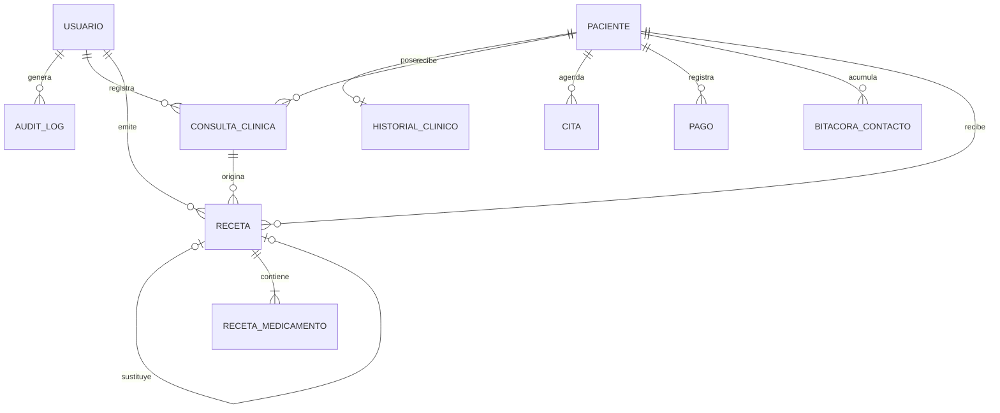

# Modelo de datos clínico

## Entidades principales

| Entidad | Campos relevantes |
| --- | --- |
| `usuarios` | username, password_hash, auth_version, cambio obligatorio, rol, perfil profesional, cédula, establecimiento, domicilio, estado, fallos, bloqueo |
| `pacientes` | identidad, género, nacimiento, contacto, dirección, ocupación, emergencia |
| `historial_clinico` | enfermedades, cirugías, antecedentes familiares, alergias, medicación, hábitos |
| `valoracion_antropometrica` | fecha, turno diario, motivo, síntomas, diagnóstico, plan, indicaciones, signos vitales, antropometría y snapshot del profesional |
| `citas` | fecha, hora, motivo, estado y cancelación |
| `pagos` | fecha, monto, concepto y método |
| `audit_logs` | fecha, request ID, usuario, módulo, acción, IP, resultado y entidad |
| `recetas` | folio, consulta, tipo, versión, estado, folio sustituido, motivo y snapshots de paciente, alergias y profesional |
| `receta_medicamentos` | genérico/marca, presentación, dosis, vía, frecuencia, duración, cantidad e indicaciones |

La tabla histórica `valoracion_antropometrica` conserva su nombre para evitar una migración destructiva; funcionalmente representa la consulta clínica general.

`(fecha, numero_cita)` es único. `numero_cita` se asigna en servidor como turno global `1..n` para cada fecha y se reinicia al cambiar de día. Los huecos históricos no se reciclan ni se usan como conteo; las métricas diarias cuentan registros.

Cada consulta admite un historial de recetas: original, adicionales y sustituciones. `(valoracion_id, version)` es único y `receta_sustituida_id` evita reemplazar dos veces el mismo folio. Las llaves foráneas usan `RESTRICT` para consulta/paciente/documento sustituido y `SET NULL` para el profesional; los medicamentos se eliminan en cascada sólo si una operación administrativa futura eliminara expresamente la receta. La interfaz actual no ofrece eliminación.
